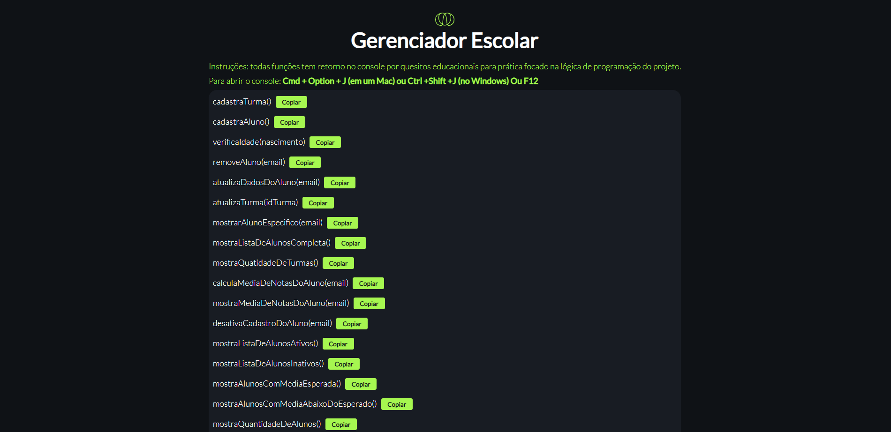

# Lógica de programação

Aqui você encontrará conceitos essenciais e exemplos práticos de Lógica de programação.

## Deploy do Projeto Final

* [Gerenciador Escolar](https://gerenciadorescolar.netlify.app/)

## Screenshots

## Código Projeto Final

* [View Code | Requisitos](https://github.com/LuisBarrichello/logica-primeiro-codigo/tree/master/projeto-final)

## Seções de conteúdo

*  [Hello world](https://github.com/LuisBarrichello/ada-logica-primeiro-codigo/blob/master/aula01/helloWord.js)
*  [Operadores de coerção](https://github.com/LuisBarrichello/ada-logica-primeiro-codigo/tree/master/aula02)
*  [Valores  Tipos nativos](https://github.com/LuisBarrichello/ada-logica-primeiro-codigo/tree/master/aula02)
*  [Operadores](https://github.com/LuisBarrichello/ada-logica-primeiro-codigo/tree/master/aula02)
*  [Desestruturação](https://github.com/LuisBarrichello/ada-logica-primeiro-codigo/tree/master/aula02)
*  [Objetos ](https://github.com/LuisBarrichello/ada-logica-primeiro-codigo/tree/master/aula02)
* [Loops](https://github.com/LuisBarrichello/ada-logica-primeiro-codigo/tree/master/aula03)
* [Funções de Array](https://github.com/LuisBarrichello/ada-logica-primeiro-codigo/tree/master/aula03)
* [Funções nativas](https://github.com/LuisBarrichello/ada-logica-primeiro-codigo/tree/master/aula03)
* [Funções](https://github.com/LuisBarrichello/ada-logica-primeiro-codigo/tree/master/aula04)
* [Condicionais](https://github.com/LuisBarrichello/ada-logica-primeiro-codigo/tree/master/aula04)
* [Desafios](https://github.com/LuisBarrichello/logica-primeiro-codigo/tree/master/desafios-agrupados)
